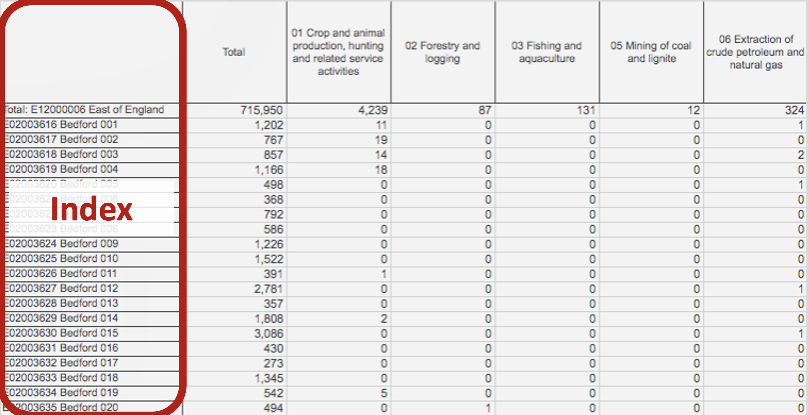

Theme: casa notes
Palette: Purple
Size: Wide
Title: Logic
Author: Jon Reades

---

Layout: Title

# Introducing Pandas

---


^ Pandas is an open source, library providing high-performance, easy-to-use data structures and data analysis tools for the Python programming language.

^ We will now start to use the Pandas package, which allows us to create ‘data frame’ objects which supports a range of **very** useful data analysis methods.

---
### Using Pandas

So here’s some code to read a CSV file:

```python
import pandas as pd          # import class
csv_df = pd.read_csv(<file>) # load a CSV
type(csv_df)                 # not simple data
csv_dv.head()                # first few rows
csv_df[’SomeColName’].mean() # summarise
```

---
### Using Pandas (cont'd)

Pandas is probably (together with scipy and numpy) the *main* reason that Python has become popular for data science. According to ‘Learn Data Sci’ it accounts for 1% of *all* Stack Overflow question views!

You will want to bookmark these:

- [pandas.pydata.org](https://pandas.pydata.org/)
- [pandas tutorial for beginners](https://www.learndatasci.com/tutorials/python-pandas-tutorial-complete-introduction-for-beginners/)

---
### Pandas Terminology (Data Frame)


---
### Pandas Terminology (Index)



---
### Pandas Terminology (Series)


---
### Pandas Terminology (Slice)


---
## What Can We Do? (Series Level)

| Command | Returns |
| :------ | :------ |
| `s.mean()` | Mean |
| `s.count()` | Number of non-null values |
| `s.max()` | Highest value |
| `s.min()` | Lowest value |
| `s.median()` | Median |
| `s.std()` | Standard deviation |
| `s.quantile(q=x)` | xth quantile |
| `s.sample(n)` | Random sample of n rows |

---
## What Can We Do? (Data Frame Level)

| Command | Returns |
| :------ | :------ |
| `df.mean()` | Mean of each columns |
| `df.count()` | Number of non-null values in each column |
| `df.max()` | Highest value in each column |
| `df.min()` | Lowest value in each column |
| `df.median()` | Median of each column |
| `df.std()` | Standard deviation of each column |
| `df.quantile(q=x)` | xth quantile of each column |
| `df.sample(n)` | Random sample of n rows from the data frame |
| `df.corr()` | Correlation between columns |

---
## What Can We Do? (Chaining)

Operations on a Data Frame **return a DataFrame** and operations on a Series **return a Series**, allowing us to 'chain' steps together:

```
df.sort_values([col1, col2], 
		ascending=False).head(20).median()
```
---
Layout: SectionTitle

## Now we can automate... data anlysis!